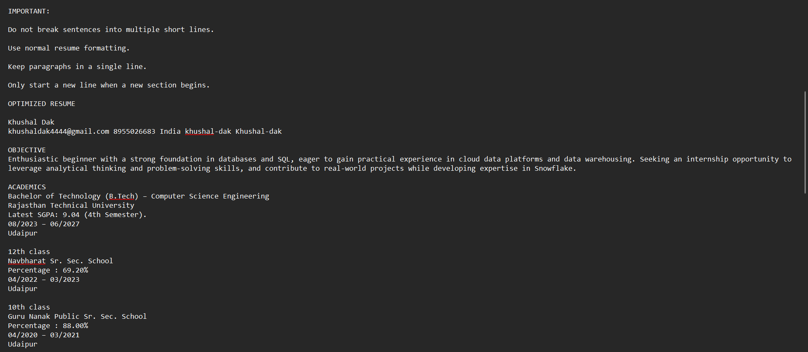

# 🚀 ATS Resume Optimizer AI

AI-powered ATS Resume Optimization Workflow built using n8n and Google Gemini.

## 📌 Overview

This project automatically analyzes a resume against a job description and generates:

✅ ATS Score  
✅ Missing Keywords  
✅ Strengths & Weaknesses Analysis  
✅ Resume Improvement Suggestions  
✅ ATS Optimized Resume  
✅ Downloadable Report

---

## 🛠 Tech Stack

- n8n
- Google Gemini AI
- PDF Processing
- JavaScript
- Google Sheets
- ATS Analysis Logic

---

## 🔄 Workflow

---

## 📥 User Input

Users upload:

- Resume (PDF)
- Job Description

---

## 📊 ATS Analysis

The workflow calculates:

- ATS Score
- Missing Keywords
- Resume Strengths
- Resume Weaknesses

---

## ✨ Resume Optimization

The system automatically updates the resume according to the Job Description.

---

## 📄 Downloadable Report

Final ATS Report can be downloaded as a text file.

---

## 🎯 Features

- ATS Score Generation
- Keyword Gap Analysis
- Resume Enhancement
- AI-Powered Optimization
- Automated Reporting
- No Manual Resume Editing Required

---

## 📈 Future Improvements

- PDF Export
- Email Delivery
- Multi-Resume Comparison
- Job Recommendation Engine

---

## 👨‍💻 Author

Khushal Dak

LinkedIn: www.linkedin.com/in/khushal-dak

GitHub: https://github.com/yourusername
